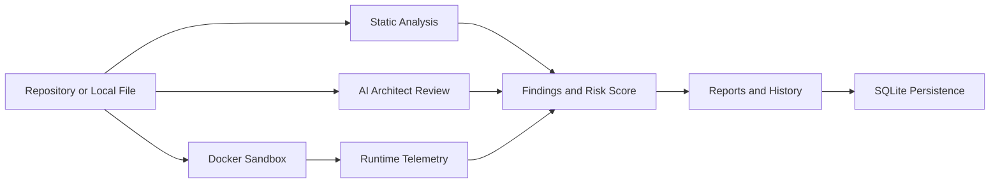

# CodeSentinel: An Open-Source Privacy-Preserving Hybrid Framework for Static, Dynamic, and LLM-Based Secure Code Analysis

CodeSentinel is a local-first desktop security auditing platform that combines static analysis, sandboxed runtime inspection, and local LLM-based review into one workflow. It is built to help teams understand code quality, uncover security issues, and track remediation without sending source code to external cloud services.

## Tags

Security Auditing | Static Analysis | Dynamic Analysis | Local AI | Ollama | Docker | SQLite | Electron | React | TypeScript | Privacy-First | Desktop App

## Visual Overview



## What CodeSentinel Does

CodeSentinel analyzes software from three complementary angles:

- Static analysis for fast detection of risky patterns, hardcoded secrets, and common vulnerability classes
- Dynamic analysis for containerized runtime observation and build/startup telemetry
- LLM-based reasoning for higher-level security insight, architecture review, and remediation guidance

This hybrid approach helps identify issues that a single scanner would miss.

## Product Highlights

- Local-first operation keeps code on the machine
- Repository onboarding and file discovery
- AI Architect review for file-level security reasoning
- Quick audit and deep audit workflows
- Dynamic analysis and container insights
- Risk scoring and historical reports
- SQLite persistence for projects, findings, and chat history
- Secure Electron preload bridge between UI and backend

## Who It Is For

- Developers who want faster security feedback while coding
- Security engineers who need a deeper audit workflow
- Teams that must keep code local for privacy or compliance reasons
- Reviewers who want both fast pattern matching and semantic reasoning

## How It Is Organized

- Main process: repository operations, AI calls, scan orchestration, persistence
- Preload bridge: secure IPC surface for renderer access
- Renderer process: user interface, routing, screens, and state management
- Docker runtime: isolated execution and telemetry collection
- Ollama runtime: local model inference for AI review

## Technology Stack

- Electron
- React
- TypeScript
- Ollama
- Docker
- SQLite

## Requirements

- Node.js 20 or newer
- npm 10 or newer
- Docker Desktop or Docker Engine
- Git
- Ollama running locally with a supported model

## Quick Start

### 1. Clone the repository

```bash
git clone https://github.com/ali-Hamza817/CodeSentinel.git
cd CodeSentinel
```

### 2. Install dependencies

```bash
npm install
```

### 3. Start Ollama

```bash
docker run -d --name codesentinel-ai -p 11434:11434 ollama/ollama
docker exec codesentinel-ai ollama pull llama3.2:latest
```

### 4. Run the application

```bash
npm run dev
```

## Typical Workflow

1. Open CodeSentinel.
2. Add a repository or select a local project.
3. Run static analysis to surface immediate findings.
4. Open AI Architect to review specific files in detail.
5. Use dynamic analysis and container insights to validate runtime behavior.
6. Review risk scores, findings, and exported reports.

## Feature Areas

- Repository management and file discovery
- Static analysis for common security issues and risky patterns
- AI Architect review for semantic reasoning
- Dynamic analysis and container insights
- Risk scoring and reporting
- Persistent local data in SQLite
- Chat history and review context stored locally

## Build

```bash
npm run build:win
```

Packaged artifacts are generated in the `release` directory.

## Project Structure

- `src/main`: orchestration, AI service, execution service, repository service
- `src/preload`: secure API bridge exposed to the renderer
- `src/renderer`: React UI, routes, screens, and state management
- `build` and `release`: packaging assets and build output

## Troubleshooting

- If Ollama is not reachable on port 11434, verify Docker is running and the container is active.
- If the model is missing, pull it again with `docker exec codesentinel-ai ollama pull llama3.2:latest`.
- If AI responses time out, retry with a smaller file or confirm the model is available locally.

## License and Use

Copyright (c) 2026 Ali Hamza. All rights reserved.

This repository is provided for non-commercial use only. Commercial use, redistribution for commercial purposes, or relicensing without permission is not allowed.

See [ATTRIBUTIONS.md](ATTRIBUTIONS.md) for third-party attributions.

